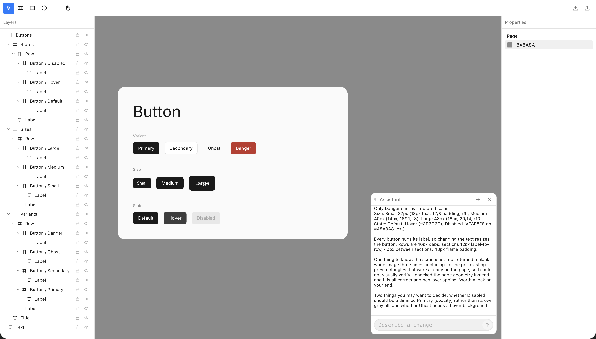

# canvas

[](https://github.com/michael-jordan-coder/canvas/actions/workflows/ci.yml)
[](LICENSE)
[](https://canvas-editor-eight-rust.vercel.app/)

A Figma-style design editor built from scratch. The canvas is drawn with WebGPU, everything
around it is React, and the line between the two never blurs: React never draws a shape, and
the renderer never knows a component exists.

**Try it live: [canvas-editor-eight-rust.vercel.app](https://canvas-editor-eight-rust.vercel.app/)**



## What it does

- **The whole document renders in one instanced draw call.** Every shape is the same
  four-corner quad; what it actually is gets decided per pixel in the fragment shader by a
  signed distance function. Corners and edges stay exact at any zoom because nothing is ever
  tessellated.
- **Text is MSDF glyphs in that same draw call**, not a second pipeline. A rectangle drawn
  over a word covers it, because glyphs and shapes share one buffer and one paint order.
- **Auto layout**: rows and columns with gap, padding, hug or fixed sizing per axis, and
  fill children, driven by a pure layout engine that returns patches and never writes.
- **Frames clip per pixel through a chain of inverse transforms**, so a rotated or scaled
  frame clips correctly, which a screen-space scissor rect could not.
- Rotation, per-corner radii, paint stacks, stroke alignment (inside, center, outside),
  opacity that composes down the tree.
- **Undo is inverse snapshots of touched nodes**: no hand-written inverse operations, no
  full-tree copies, and a drag of any length is one step.
- **Hit testing uses the same distance function the shader draws with**, so what you can
  click is exactly what you can see, corner radius bites included.
- Autosave to localStorage, real clipboard copy and paste (works across tabs), and a
  hand-validated file format where every parse failure names the path that failed.
- Pan and zoom is one 48-byte uniform write. A document of any size pans as cheaply as an
  empty one, and drawing is on demand rather than a permanent requestAnimationFrame loop.
- **An AI design agent with hands on the canvas.** A Node sidecar runs Claude through the
  Agent SDK and bridges it to the editor over a WebSocket: every tool call becomes a real
  edit in the live document, visible as it happens, and a whole agent turn folds into one
  undo step. It sees its own work through a screenshot tool and judges it before reporting
  back.

## Architecture

```
packages/document   the scene: nodes, transforms, paints, layout. Plain TypeScript.
                    No DOM, no GPU, no React (enforced by tsconfig: lib ES2022 only).
packages/renderer   WebGPU. Reads the document directly. No React.
apps/editor         React panels, input handling, wiring.
apps/agent-server   the AI agent sidecar: Claude Agent SDK, WebSocket bridge, canvas tools.
```

Dependencies point one way only: `editor -> renderer -> document`. The boundaries are real
module boundaries in a pnpm workspace, so crossing one is an import error rather than a code
review note.

The scene is a mutable store outside React, because the renderer reads it at frame rate
during a drag. React reads it through subscription hooks with per-node revisions, so a panel
showing one node wakes only when that node changes.

[CLAUDE.md](CLAUDE.md) is the full architecture document: why the split is enforced, how
undo, text, clipping, and auto layout actually work, and the wrong versions of each that
still render.

## Running it

```
pnpm install
pnpm dev        # editor on http://localhost:5173, agent sidecar on :5174
```

Requires a browser with WebGPU: Chrome, Edge, or Safari 26. Firefox needs the flag on macOS.

The agent sidecar authenticates through the Claude Code login on the machine, so there is
no API key to configure. Without that login the editor works as normal and the agent panel
just shows offline.

```
pnpm check      # typecheck and test together
pnpm test       # vitest across the workspace
pnpm typecheck  # every package
```

The renderer is testable without a GPU: a stub device captures the exact bytes `writeBuffer`
would have received, so a packing bug shows up as a number in the wrong slot rather than a
shape in the wrong place.

## Trying the numbers

`?stress=10000` seeds a grid of that many nodes, and `?perf` shows instances drawn, culled,
build time and frame time. Autosave is off in stress mode.

## Contributing

Contributions are welcome. [CONTRIBUTING.md](CONTRIBUTING.md) has the short version, the
[good first issue](https://github.com/michael-jordan-coder/canvas/labels/good%20first%20issue)
label has contained starting points with file pointers, and the deferred lists in
[TASKS.md](TASKS.md) are full of designed-but-unbuilt features looking for an owner.
Participation is covered by the [Code of Conduct](CODE_OF_CONDUCT.md); found a security issue
instead, see [SECURITY.md](SECURITY.md).

## License

MIT. The bundled Inter font is licensed separately under the SIL Open Font License 1.1
(`packages/renderer/src/font/OFL.txt`).
